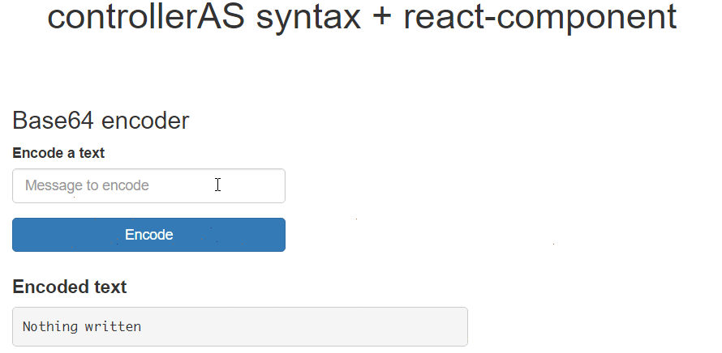

# Angular 1.X integration: controllerAs + react-component

## Description

This sample is one of the four _AngularJS integration_ samples that shows how to integrate React components in an existing AngularJS application.
This particular sample uses a simple form created handled by a controller using _controllerAs_ syntax and _react-component_ directive.

## Boilerplate

We'll be using JSX syntax so we will reuse the same Gulp configuration and package.json from sample [04 Event Emitters](../04\ Event\ Emitters).

- First let's add AngularJS:

  ```shell
  npm install --save angular@^1.6.1
  ```

- Next let's write an `index.html` with a simple form that ask the user for a text, encodes a text into base64 and shows it in a well. We'll add `ng-app="app"`, `ng-controller="Main as ctrl"` directives:

  ```html
  <!DOCTYPE html>
  <html lang="en" ng-app="app">
    <head>
      <meta charset="UTF-8">
      <title>05.A Angular integration</title>
      <meta name="viewport" content="width=device-width, user-scalable=no, initial-scale=1.0, maximum-scale=1.0, minimum-scale=1.0">
      <link rel="stylesheet" href="./node_modules/bootstrap/dist/css/bootstrap.min.css">
      <link rel="stylesheet" href="./dist/css/styles.css">
    </head>
    <body>
      <header>
        <h1 class="text-center">controllerAS syntax + react-component</h1>
      </header>
      <main class="container">
        <section>
          <div ng-controller="Main as ctrl">
            <form class="col-md-5" action="#" ng-submit="ctrl.encode($event)">
              <h3>Base64 encoder</h3>
              <div class="form-group">
                <label for="txtMessage">Encode a text</label>
                <input type="text" class="form-control" id="txtMessage" ng-model="ctrl.text" placeholder="Message to encode">
              </div>
              <div class="form-group">
                <button type="submit" class="btn btn-primary btn-block">Encode</button>
              </div>
            </form>
            <div class="col-md-8">
              <h4>
                <strong>Encoded text</strong>
              </h4>
              <pre>{{ctrl.encodedText || 'Nothing written'}}</pre>
            </div>
          </div>
        </section>
      </main>
      <script src="./node_modules/angular/angular.js"></script>
      <script src="./dist/app.module.js"></script>
      <script src="./dist/controllers/main.controller.js"></script>
    </body>
  </html>
  ```

- Next let's add the `app` module  with the next content (we will write our assets under `src` folder):

  ```javascript
  (function (angular) {
    'use strict';

    angular.module('app', []);
  })(window.angular);
  ```

- Then let's create the `main` controller that stores the text and its encoded version:

  ```javascript
  (function (angular) {
    'use strict';

    function Main() {
      var self = this;
      self.text = '';
      self.encodedText = '';
      self.encode = function (event) {
        event.preventDefault();
        self.encodedText = btoa(self.text);
      };
    }
    angular.module('app').controller('Main', [Main]);
  })(window.angular);
  ```

We'll end with this page:



## React injection

It's time to add React and our first component.

- First let's install `React`, `ReactDOM` and [ngReact](https://github.com/ngReact/ngReact):

  ```shell
  npm install --save react react-dom ngreact
  ```

- Next let's create our first component under a new `components` folder that will replace the view for the encoded text. We will call it `ShowEncoded.jsx`:

  ```jsx
  (function (angular, React) {
    'use strict';

    var ShowEncoded = function (props) {
      return (
        <div>
          <h4>
            <strong>Encoded text</strong>
          </h4>
          <pre>{props.encoded || 'Nothing written'}</pre>
        </div>
      );
    };

    ShowEncoded.propTypes = {
      encoded: React.PropTypes.string.isRequired
    };

    angular.module('app').value('ShowEncoded', ShowEncoded);
  })(window.angular, window.React);
  ```

  This component will receive an `encoded` string property and will show it in a `<pre>` tag.

- Next let's replace the view with our `ShowEncoded` component in `index.html`:

```diff
          </form>
          <div class="col-md-8">
+           <react-component
+             name="ShowEncoded"
+             props="{encoded: ctrl.encodedText}"
+             watch-depth="reference" />
-           <h4>
-             <strong>Encoded text</strong>
-           </h4>
-           <pre>{{ctrl.encodedText || 'Nothing written'}}</pre>
-         </div>
         </div>
      </section>
    </main>
    <script src="./node_modules/angular/angular.js"></script>
+   <script src="./node_modules/react/dist/react.js"></script>
+   <script src="./node_modules/react-dom/dist/react-dom.js"></script>
+   <script src="./node_modules/ngreact/ngReact.js"></script>
    <script src="./dist/app.module.js"></script>
    <script src="./dist/controllers/main.controller.js"></script>
+   <script src="./dist/components/ShowEncoded.js"></script>
  </body>
</html>
```
Finally let's add `react` from `ngReact` as a dependency for our `app` module:

```diff
(function (angular) {
  'use strict';

- angular.module('app', []);
+ angular.module('app', ['react']);
})(window.angular);
```

We've implemented our first component using `controlerAs` syntax and `react-component` directive. In the next sample we'll see how to implement the same sample using `reactDirective` factory.
