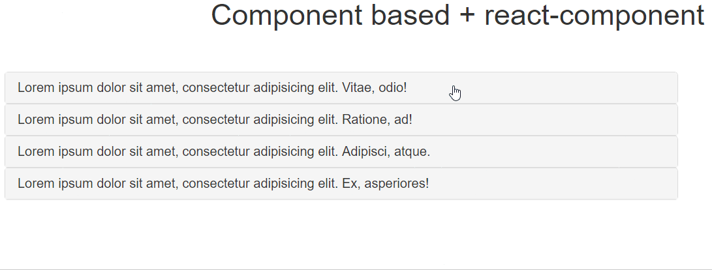

# Angular 1.X integration: controllerAs + reactDirective

## Description

This sample is one of the four _AngularJS integration_ samples that shows how to integrate React components in an existing AngularJS application.
This particular sample uses a component base application that shows an accordion panel using `angular.component` and gets remplaced by a React accordion.

## Boilerplate

We'll take as starting point sample [05.B Angular controllerAs & factory](../05.B\ Angular\ controllerAs\ &\ factory).

## Including web server

We'll make few changes in `gulpfile.js` to include a web server because AngularJS `templateUrl` uses XMLHttpRequests to include templating and `file://` protocol is not included.

- First install `gulp-connect` through `npm`. This will allow us to raise a lite web server up:

  ```shell
  npm install --save-dev gulp-connect
  ```

- Next let's add a Gulp task to configure the server:

  ```diff
  var path = require('path');
  var gulp = require('gulp');
  var babel = require('gulp-babel');
  var del = require('del');
  +var connect = require('gulp-connect');

  var BUILD_DIR = path.resolve(__dirname, 'src');
  var DIST_DIR = path.resolve(__dirname, 'dist');

  +gulp.task('connect', function (done) {
  + connect.server({
  +   root: __dirname
  + });
  + done();
  +});

  gulp.task('transpile', function () {

  ...

  -gulp.task('default', gulp.parallel('build', 'watch'));
  +gulp.task('default', gulp.parallel(gulp.series('build', 'connect'), 'watch'));
  ```

- Finally let's include a start script that boot the server in `package.json`:

  ```diff
  "license": "MIT",
    "scripts": {
  -   "build": "gulp build",
  -   "build:watch": "gulp"
  +   "start": "gulp",
  +   "build": "gulp build"
    },
    "dependencies": {
  ```

## Preparing the Angular accordion

We'll remove `controllers` folder along with `ShowEncoded.jsx` file and create an `page-content`, `accordion` and `accordion-panel` with their templates in `components`. Our `src` folder structure should look like this:

```
src
├── app.module.js
├── components
│   ├── accordion
│   │   ├── accordion.html
│   │   ├── accordion.js
│   │   └── accordion-panel
│   │       ├── accordion-panel.html
│   │       └── accordion-panel.js
│   ├── page-content
│   │   ├── page-content.html
│   │   └── page-content.js
│   └── ShowEncoded.jsx
└── css
    └── styles.css
```

The `page-content` component will be used as a container and layout former that will have a list of items to feed the accordion.

```html
<!-- components/page-content/page-content.html -->
<header>
  <h1 class="text-center">Component based App</h1>
</header>
<main class="container">
  <div class="col-sm-9">
    <accordion feeds="$ctrl.feeds" />
  </div>
</main>
```
```javascript
// components/page-content/page-content.js
(function (angular) {
  'use strict';

  function PageContent() {
    var self = this;

    self.feeds = [
      {
        heading: 'Lorem ipsum dolor sit amet, consectetur adipisicing elit. Vitae, odio!',
        content: 'Lorem ipsum dolor sit amet, consectetur adipisicing elit. Obcaecati vel, officia saepe cumque culpa alias quisquam rem repudiandae omnis dolorum doloremque, dicta pariatur unde iusto ex, eos neque laboriosam voluptatum.'
      },
      {
        heading: 'Lorem ipsum dolor sit amet, consectetur adipisicing elit. Ratione, ad!',
        content: 'Lorem ipsum dolor sit amet, consectetur adipisicing elit. Quisquam eum et ea harum laborum temporibus ab voluptates sunt, maxime dolore quas consequuntur vitae quos expedita nostrum quidem, minus, rem sit.'
      },
      {
        heading: 'Lorem ipsum dolor sit amet, consectetur adipisicing elit. Adipisci, atque.',
        content: 'Lorem ipsum dolor sit amet, consectetur adipisicing elit. Eveniet, tempore aut consequuntur autem, repellat iste doloremque quibusdam sunt quos! At minus dicta debitis doloremque dolorem unde, maxime facilis voluptatum quam!'
      },
      {
        heading: 'Lorem ipsum dolor sit amet, consectetur adipisicing elit. Ex, asperiores!',
        content: 'Lorem ipsum dolor sit amet, consectetur adipisicing elit. Fugiat, omnis dolores tempora officia consequuntur ratione sequi aliquid porro aut quisquam quas obcaecati facere assumenda minima odit reiciendis laboriosam natus! Eum!'
      },
    ];
  }

  angular
    .module('app')
    .component('pageContent', {
      controller: PageContent,
      templateUrl: './dist/components/page-content/page-content.html'
    });
})(angular);
```

The `accordion` component will be a simple wrapper that accepts a `feeds` array and render as many panes as items in `feeds`:

```html
<!-- components/accordion/accordion.html -->
<div class="panel-group" role="tablist">
  <accordion-panel ng-repeat="feed in $ctrl.feeds track by $index" feed="feed" />
</div>
```

```javascript
// components/accordion/accordion.js
(function (angular) {
  function AccordionController() {
    var self = this;
    var panels = [];

    self.addPanel = function (panel) {
      panels.push(panel);
      if (panels.length) {
        panels[0].show();
      }
    };

    self.select = function (selectedPanel) {
      panels.forEach(function (panel) {
        if (panel === selectedPanel) {
          panel.show();
        } else {
          panel.hide();
        }
      });
    };
  }

  angular
    .module('app')
    .component('accordion', {
      bindings: {
        feeds: '<'
      },
      templateUrl: './dist/components/accordion/accordion.html',
      controller: AccordionController
    });
})(window.angular);
```

The `accordion-panel` will show the heading and content of the feed. It will receive the `feed` object and render the panel.

```html
<!-- components/accordion/accordion-panel.html -->
<div class="panel panel-default">
  <div class="panel-heading" style="cursor: pointer" ng-click="$ctrl.select()" role="panel">
    <h3 class="panel-title">{{$ctrl.feed.heading}}</h3>
  </div>
  <div class="panel-body collapsible" ng-class="$ctrl.active">
    {{$ctrl.feed.content}}
  </div>
</div>
```

```javascript
// components/accordion-panel/accordion-panel.js
(function (angular) {
  'use strict';

  function AccordionPane() {
    var self = this;
    var selected = false;

    self.$onInit = function () {
      self.parent.addPanel(self);
    };

    self.select = function () {
      self.parent.select(self);
    };

    self.show = function () {
      if (selected) {
        self.hide();
      } else {
        selected = true;
        self.active = 'in';
      }
    };

    self.hide = function () {
      selected = false;
      self.active = '';
    };
  }

  angular
    .module('app')
    .component('accordionPanel', {
      bindings: {
        feed: '<'
      },
      require: {
        parent: '^accordion'
      },
      templateUrl: './dist/components/accordion/accordion-panel/accordion-panel.html',
      controller: AccordionPane
    });
})(window.angular);
```

Finally let's add some styles in `styles.css` file to animate the accordion:

```css
.container, .container-fluid {
  margin-top: 50px;
  overflow: hidden;
}

.panel-body.collapsible {
  transition: all .30s ease-out;
  max-height: 0;
  overflow: hidden;
  padding-top: 0;
  padding-bottom: 0;
}

.panel-body.collapsible.in {
  max-height: 100px;
  transition: all .30s ease-out;
  padding-top: 15px;
  padding-bottom: 15px;
}

.panel-body.collapsible > * {
  margin-left: 15px;
  margin-right: 15px;
}

.panel-body.collapsible > *:first-child {
  margin-top: 15px;
}

.panel-body.collapsible > *:last-child {
  margin-bottom: 15px;
}
```
If we open a command line prompt, locate to the root directory of the project and execute `npm start` we'll see at [localhost:8080](http://localhost:8080) the next result:



## Replacing the accordion
